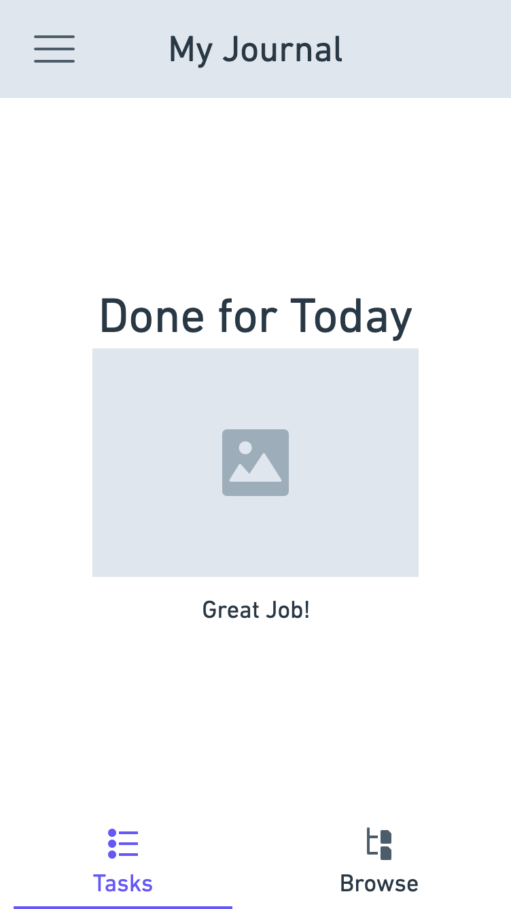
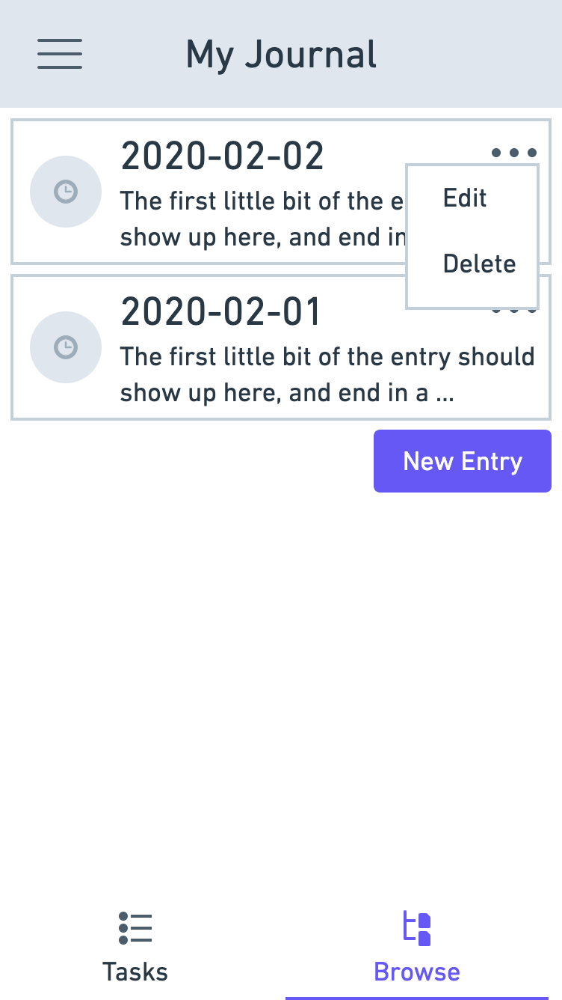

# MS1 - Journal

## Objective
I can create a journal and am prompted to create an entry every day.

## Requirements
1) When I launch the app for the first time, I am prompted to create a writing project.
1) When I create a new writing project, I can enter a name, description, and select `journal` as the type, and then I'm taken to the journal project (task tab).
1) When viewing my journal project (task tab) and I don't have an entry for today, I am prompted to create an entry.
1) When creating a journal entry, the date should be pre-filled with today's date and an empty text area should be shown.
1) When creating or editing a journal entry, I can click on the microphone to enable dictation (platform specific).
1) After completing a journal entry, I should be taken to the journal project (view tab).
1) When viewing my journal project (task tab) and I have already created an entry for today, I should see a "Well Done" message.
1) When I launch the app after creating at least 1 project, I am taken to the last project I viewed.
1) When viewing my journal project, I can press the hamburger button to open the menu. I can switch projects (taking me to the project list) or go to project settings (taking me to the project settings page).
1) When I am on the project list I can delete projects (and am asked to confirm).
1) When I am on the journal (browse tab) or the entry itself I can delete journal entries (and am asked to confirm).
1) When I am editing an entry and have made changes, going back or clicking cancel asks me to confirm.

## Designs
|   |   |   |   |   |
|---|---|---|---|---|
|  |  |  |  |  |
|  |  |  |  |  |
|  |  |  |  |  |
|  |  |  |  |  |
|  |  |  |  |  |
|  |  |  |  |  |

## Out of Scope
1) A rich text editor for the Journal Entry
1) Sorting and filtering on the project list and journal browse tab
1) Notifications and Timers
